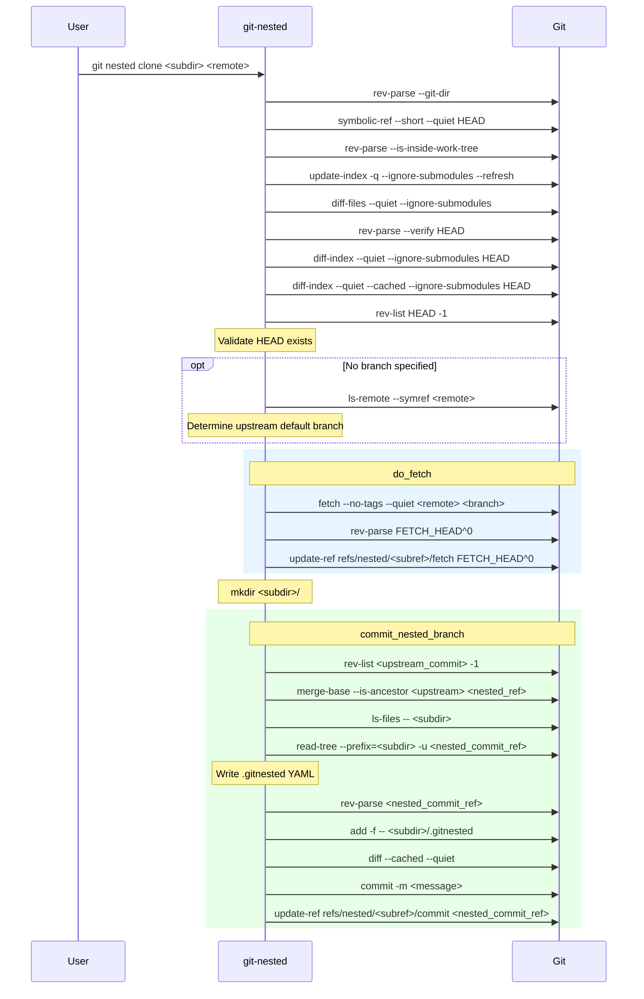
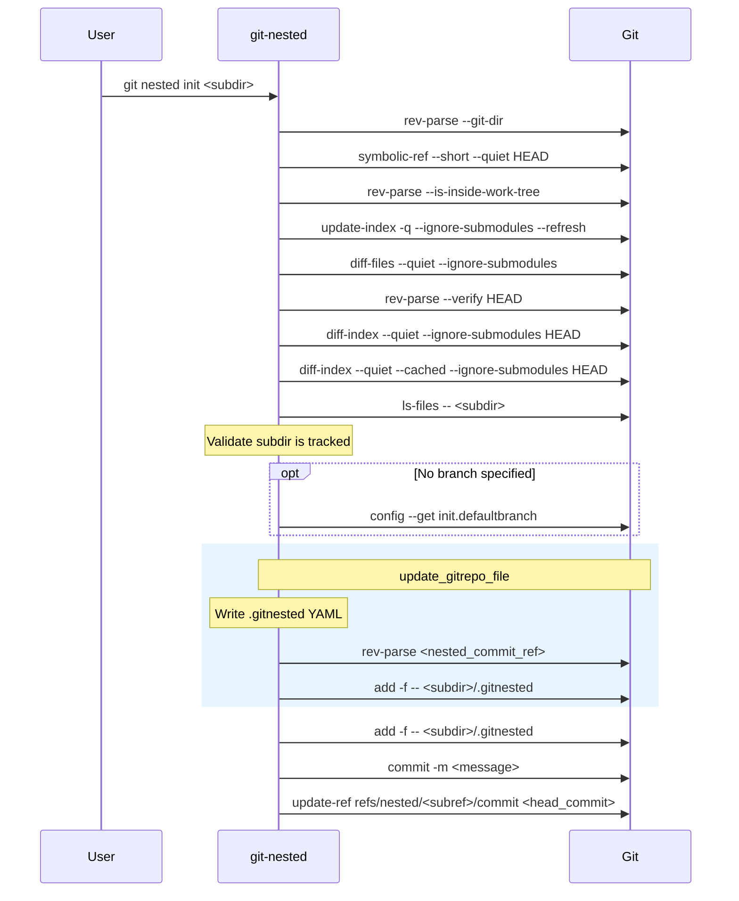
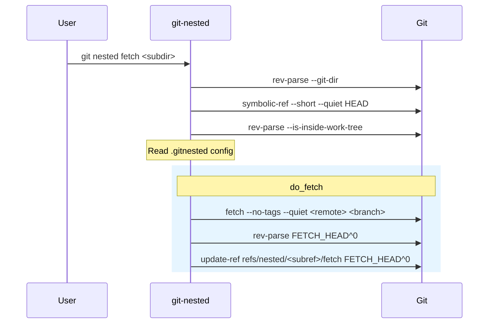
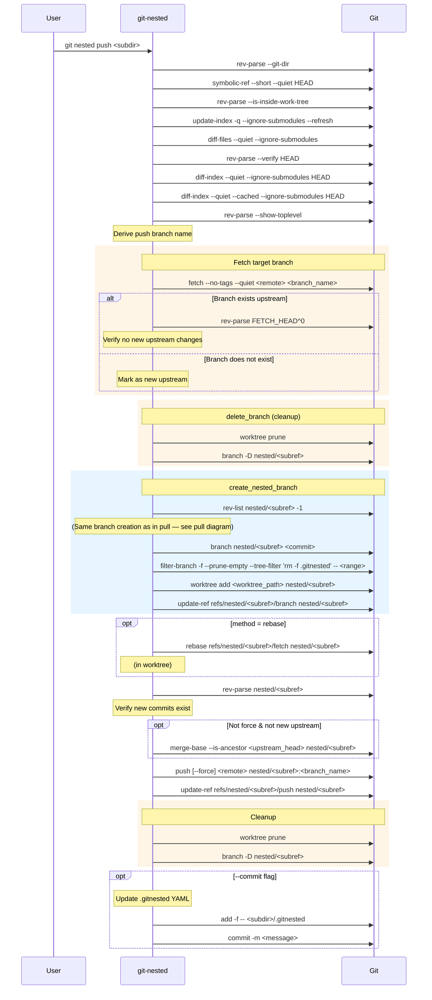
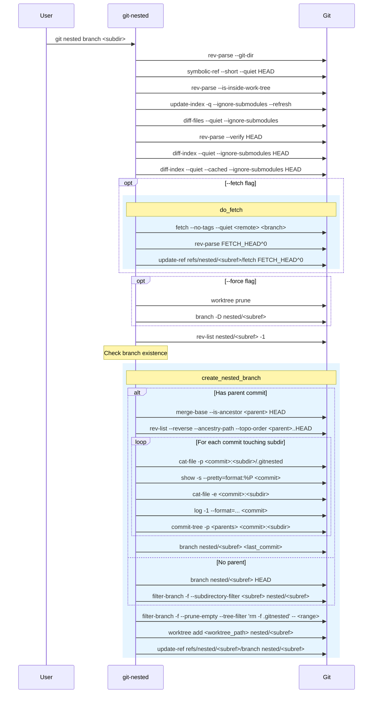
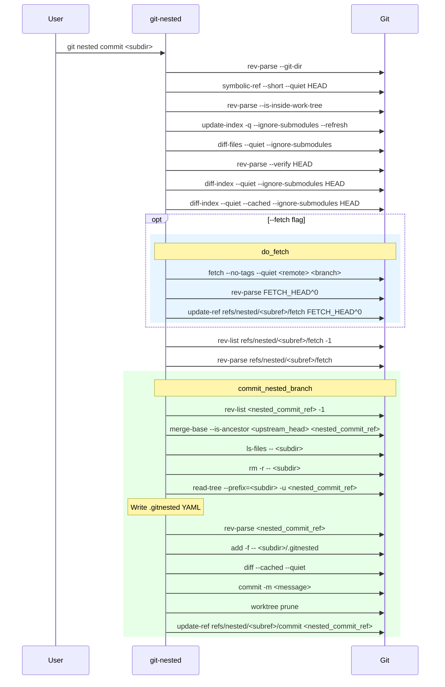
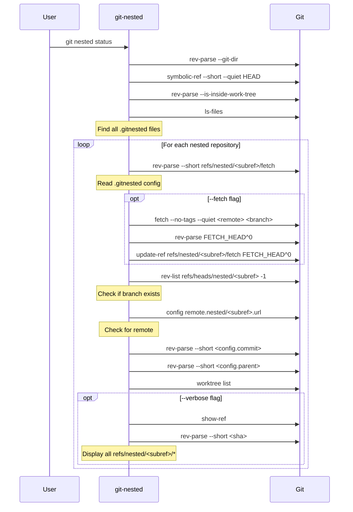
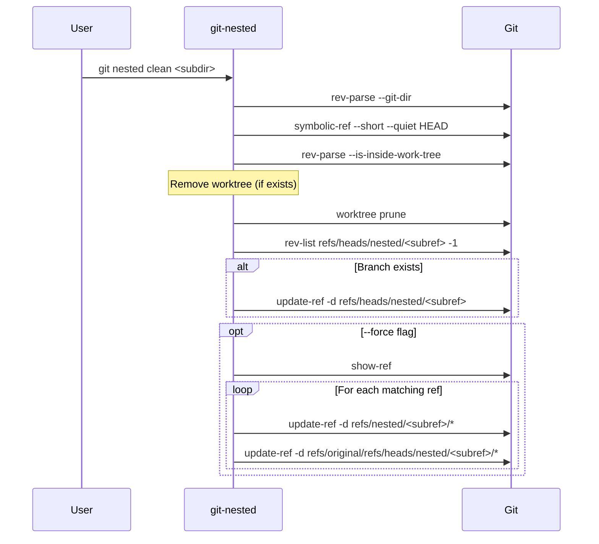

# git-nested — Subcommand Git Call Diagrams

Each diagram below shows the sequence of underlying `git` commands executed by a `git nested` subcommand.

---

## clone

---

## init

---

## fetch

---

## pull

```mermaid
sequenceDiagram
    participant User
    participant git-nested
    participant Git

    User->>git-nested: git nested pull <subdir>
    git-nested->>Git: rev-parse --git-dir
    git-nested->>Git: symbolic-ref --short --quiet HEAD
    git-nested->>Git: rev-parse --is-inside-work-tree
    git-nested->>Git: update-index -q --ignore-submodules --refresh
    git-nested->>Git: diff-files --quiet --ignore-submodules
    git-nested->>Git: rev-parse --verify HEAD
    git-nested->>Git: diff-index --quiet --ignore-submodules HEAD
    git-nested->>Git: diff-index --quiet --cached --ignore-submodules HEAD

    rect rgb(230, 245, 255)
        Note over git-nested,Git: do_fetch
        git-nested->>Git: fetch --no-tags --quiet <remote> <branch>
        git-nested->>Git: rev-parse FETCH_HEAD^0
        git-nested->>Git: update-ref refs/nested/<subref>/fetch FETCH_HEAD^0
    end

    alt Up to date
        Note over git-nested: Return early (no changes)
    else Has changes
        rect rgb(255, 245, 230)
            Note over git-nested,Git: delete_branch (cleanup old)
            git-nested->>Git: worktree prune
            git-nested->>Git: branch -D nested/<subref>
        end

        rect rgb(230, 245, 255)
            Note over git-nested,Git: create_nested_branch
            git-nested->>Git: rev-list nested/<subref> -1
            Note over git-nested: Check branch existence

            alt Has parent commit (incremental)
                git-nested->>Git: merge-base --is-ancestor <parent> HEAD
                git-nested->>Git: rev-list --reverse --ancestry-path --topo-order <parent>..HEAD
                loop For each commit touching subdir
                    git-nested->>Git: cat-file -p <commit>:<subdir>/.gitnested
                    git-nested->>Git: show -s --pretty=format:%P <commit>
                    git-nested->>Git: cat-file -e <commit>:<subdir>
                    git-nested->>Git: log -1 --format=%ad,%ae,%an,%cd,%ce,%cn,%B <commit>
                    git-nested->>Git: commit-tree -p <parents> <commit>:<subdir>
                end
                git-nested->>Git: branch nested/<subref> <last_commit>
            else No parent (first time)
                git-nested->>Git: branch nested/<subref> HEAD
                git-nested->>Git: filter-branch -f --subdirectory-filter <subref> nested/<subref>
            end

            git-nested->>Git: filter-branch -f --prune-empty --tree-filter 'rm -f .gitnested' -- <range>
            git-nested->>Git: worktree add <worktree_path> nested/<subref>
            git-nested->>Git: update-ref refs/nested/<subref>/branch nested/<subref>
        end

        alt method = merge
            git-nested->>Git: merge refs/nested/<subref>/fetch
            Note over git-nested: (in worktree)
        else method = rebase
            git-nested->>Git: rebase refs/nested/<subref>/fetch nested/<subref>
            Note over git-nested: (in worktree)
        end

        git-nested->>Git: update-ref refs/nested/<subref>/branch nested/<subref>

        rect rgb(230, 255, 230)
            Note over git-nested,Git: commit_nested_branch
            git-nested->>Git: rev-parse refs/nested/<subref>/fetch
            git-nested->>Git: ls-files -- <subdir>
            git-nested->>Git: rm -r -- <subdir>
            git-nested->>Git: read-tree --prefix=<subdir> -u <nested_commit_ref>
            Note over git-nested: Write .gitnested YAML
            git-nested->>Git: add -f -- <subdir>/.gitnested
            git-nested->>Git: diff --cached --quiet
            git-nested->>Git: commit -m <message>
            git-nested->>Git: worktree prune
            git-nested->>Git: update-ref refs/nested/<subref>/commit <nested_commit_ref>
        end
    end
```

---

## push

---

## branch

---

## commit

---

## status

---

## clean

